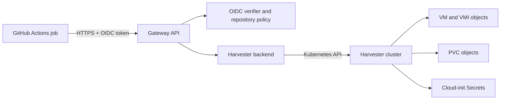

# Harvester Runner Gateway architecture

The gateway is an HTTPS API that lets approved GitHub Actions jobs create and
manage short-lived Harvester VMs and volumes. The gateway holds the Kubernetes
kubeconfig; workflow jobs authenticate with GitHub OIDC tokens and receive no
cluster credentials. [OpenAPI](openapi.yaml) defines the public API.

## Request and ownership model

Every resource request passes through the OIDC verifier. It checks the token's
signature, issuer, audience, time claims, repository ID, runner environment,
workflow reference, and event name against the configured repository policy.
The numeric repository ID, run ID, and run attempt identify the owner. Jobs in
the same run attempt share resources and quota. Each repository policy selects
the namespace and allowed resource settings.

Created VMs, independent volume PVCs, boot disk PVCs, and cloud-init Secrets
carry labels identifying the gateway, owner, and resource kind. Their annotations
include an expiry time; VM and independent volume objects also carry a hash of
the create request. The Kubernetes objects are the durable resource record. The
gateway has no resource database, VM status cache, or Kubernetes informer.

For a create request, the gateway derives a stable `rgw-` resource ID from the
owner, resource kind, and `Idempotency-Key`. It hashes the request body separately.
If that ID already exists with the same request hash, the API returns the
existing resource. A different request with the same key returns a conflict.

## How VM status is read

`GET /v1/vms/{id}` reads from Harvester for **each request**:

1. The API verifies the caller and selects its repository policy and owner.
2. The backend gets the VM object by ID from the policy namespace through the
   Kubernetes API. It checks the VM's ownership labels; an absent or unowned VM
   returns `404`.
3. It builds `phase` from the VM's `status.printableStatus`, with `Provisioning`
   as the fallback and `Deleting` when a deletion timestamp is present. It reads
   attached independent volume IDs from the VM specification and expiry from
   the VM annotation.
4. It gets the matching VirtualMachineInstance (VMI) from the Kubernetes API.
   An existing VMI yields `powerState: "on"` and any reported interface IP
   addresses. A missing VMI yields `powerState: "off"` and an empty IP list.

`GET /v1/vms` lists owner-labeled VM objects from the cluster and builds the
same status for each one, including a VMI lookup. `GET /v1/volumes/{id}` reads
the PVC and checks cluster objects for attachment state. These reads do not
return an in-memory snapshot. If a cluster read fails for a reason other than
an absent object, the API returns a cluster error instead of stale status.
Status reflects what the Kubernetes API reports at read time; provisioning and
guest network reporting can still lag behind a create or power action. An IP
address does not establish that SSH or a guest service is ready.

## Quota and lifecycle

The gateway counts owner-labeled VMs and independent volume PVCs by listing
cluster objects. Provisioning and deleting objects continue to count until
they disappear. Each VM consumes one VM quota slot; its boot disk PVC is not
counted separately. A process-local mutex serializes quota checks with creates, so
the current design requires one gateway instance for reliable quota enforcement.
That mutex does not store resource status.

VM creation writes a cloud-init Secret and VM object, then requests a KubeVirt
start action. The VM's boot disk is a PVC created from its volume claim template.
Independent volumes are separate PVCs and can be attached to running VMs. A
successful create response can precede completion of VM or volume provisioning;
clients poll the GET endpoint for progress.

At startup and every minute, the gateway lists its labeled cluster resources
and removes expired VMs, volumes, boot disks, and cloud-init Secrets. If an
independent volume is still attached when it expires, cleanup first requests
detach and deletes it on a later pass. This scan also lets cleanup resume after
a gateway restart. Deleting a VM does not delete its independent volumes.

## Code map

| Area | Implementation |
| --- | --- |
| HTTP routes, status response, quota lock | [`internal/gateway/api.go`](internal/gateway/api.go) |
| OIDC verification and owner identity | [`internal/auth/oidc.go`](internal/auth/oidc.go) |
| Kubernetes clients, labels, and annotations | [`internal/harvester/backend.go`](internal/harvester/backend.go) |
| VM lookup, status, creation, and actions | [`internal/harvester/vm.go`](internal/harvester/vm.go) |
| Volume status and expiry cleanup | [`internal/harvester/volume.go`](internal/harvester/volume.go) |
| Startup and cleanup schedule | [`cmd/harvester-runner-gateway/main.go`](cmd/harvester-runner-gateway/main.go) |
