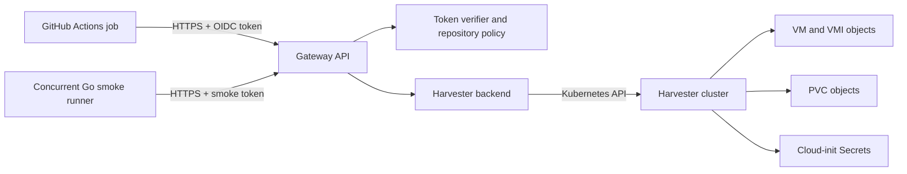

# Harvester Runner Gateway architecture

The gateway is an HTTPS API that lets approved GitHub Actions jobs create and
manage short-lived Harvester VMs and volumes. The gateway holds the Kubernetes
kubeconfig; workflow jobs authenticate with GitHub OIDC tokens and receive no
cluster credentials. [OpenAPI](openapi.yaml) defines the public API.

## Request and ownership model

Workflow resource requests pass through the OIDC verifier. It checks the
token's signature, issuer, audience, time claims, repository ID, runner
environment, workflow reference, and event name against the configured
repository policy. The optional local smoke credential maps to one configured
repository policy and the reserved `local-smoke` run identity. A workflow's
numeric repository ID, run ID, and run attempt identify its owner. Jobs in the
same run attempt share resources. Local smoke and workflow resources have
separate owners, while all runs of a repository share its quota. Each
repository policy selects the namespace and allowed resource settings.

Created VMs, VMIs, independent volume PVCs, boot disk PVCs, and cloud-init
Secrets carry `runner-gw-*` ownership, kind, and expiry metadata. OIDC
resources also carry the exact verified workflow ref as a
`runner-gw-workflow-ref` annotation. The resource name is not an
authorization credential; every operation checks repository, run, and attempt
labels.

VMs use `<vmPrefix><hex>` IDs and independent volumes use
`<volumePrefix><hex>` IDs. The default prefixes yield `ci-vm-00000001` and
`ci-vol-00000001` as the first IDs. Lowercase hex numbers have at least eight
digits; each kind has a separate gateway-wide counter across repositories and
namespaces. Boot disks and cloud-init Secrets use `<id>-root` and
`<id>-init`. The allocator commits each reservation to SQLite before
creating the Kubernetes object. At startup it scans surviving VM, VMI, PVC,
and Secret metadata to raise each allocation floor. SQLite keeps reservation
history and binds both prefixes across restarts.

## How VM status is read

`GET /v1/vms/{id}` reads from Harvester for **each request**:

1. The API verifies the caller and selects its repository policy and owner.
2. The backend gets the VM object by ID from the policy namespace through the
   Kubernetes API. It checks the VM's ownership labels; an absent or unowned VM
   returns `404`.
3. It builds `phase` from the VM's `status.printableStatus`, with `Provisioning`
   as the fallback and `Deleting` when a deletion timestamp is present. It reads
   attached independent volume IDs from the VM specification and expiry from
   the VM annotation.
4. It gets the matching VirtualMachineInstance (VMI) from the Kubernetes API.
   An existing VMI yields `powerState: "on"`. The gateway collects valid,
   usable IPv4 and IPv6 addresses reported for `nic-1` from both VMI IP fields,
   removes duplicates and link-local/loopback/unspecified/multicast addresses,
   and sorts the result. A missing VMI yields `powerState: "off"` and an empty
   IP list. `ready` is true only when the VMI phase is `Running` and that list is
   nonempty.

`GET /v1/vms` lists gateway-managed VM objects, filters them by owner, and builds the
same status for each one, including a VMI lookup. `GET /v1/volumes/{id}` reads
the PVC and checks cluster objects for attachment state. These reads do not
return an in-memory snapshot. If a cluster read fails for a reason other than
an absent object, the API returns a cluster error instead of stale status.
Status reflects what the Kubernetes API reports at read time; provisioning and
guest network reporting can still lag behind a create or power action. An IP
address does not establish that cloud-init, SSH, or a guest service is ready.
For the Multus bridge network, reliable IP reporting requires QEMU Guest Agent
in the approved image.

The HTTP create API remains asynchronous. The bundled CLI polls VM status every
ten seconds by default and returns when `ready` becomes true.

## Quota and lifecycle

The gateway counts VMs and independent volume PVCs labeled for the repository
across all runs and attempts by listing cluster objects. Count queries do not
fetch VMIs or resolve volume attachments; full status reads still do.
Provisioning and deleting objects continue to count until they disappear. Each
VM consumes one VM quota slot; its boot disk PVC is not counted separately. An
operation gate serializes allocation, quota checks, creates, deletes, and
cleanup. The serialized quota checks still require exactly one active
gateway instance.

VM creation writes a cloud-init Secret and VM object, then requests a KubeVirt
start action. The VM's boot disk is a PVC created from its volume claim template.
Independent volumes are separate PVCs and can be attached to running VMs. A
successful create response can precede completion of VM or volume provisioning;
clients poll the GET endpoint for progress.

At startup the gateway opens SQLite, scans surviving resources for a safe
allocation floor, then runs expiry cleanup. Every minute it lists its labeled
cluster resources and removes expired VMs, volumes, boot disks, and cloud-init
Secrets. If an independent
volume is still attached when it expires, cleanup first requests detach and
deletes it on a later pass. This scan also lets cleanup resume after
a gateway restart. Deleting a VM also deletes its attached independent volumes.

## Code map

| Area | Implementation |
| --- | --- |
| HTTP routes, operation gate, allocator and SQLite store | [`internal/gateway/api.go`](internal/gateway/api.go), [`internal/gateway/allocation.go`](internal/gateway/allocation.go), [`internal/gateway/allocation_sqlite.go`](internal/gateway/allocation_sqlite.go) |
| OIDC verification and owner identity | [`internal/auth/oidc.go`](internal/auth/oidc.go) |
| Kubernetes clients, metadata, recovery scan | [`internal/harvester/backend.go`](internal/harvester/backend.go), [`internal/harvester/allocation.go`](internal/harvester/allocation.go) |
| VM lookup, status, creation, and actions | [`internal/harvester/vm.go`](internal/harvester/vm.go) |
| Volume status and expiry cleanup | [`internal/harvester/volume.go`](internal/harvester/volume.go) |
| Public typed client and transport | [`client/`](client/) |
| Concurrent smoke orchestration | [`internal/smoke/smoke.go`](internal/smoke/smoke.go) |
| Startup and cleanup schedule | [`cmd/hvst-runner-gw/main.go`](cmd/hvst-runner-gw/main.go) |
